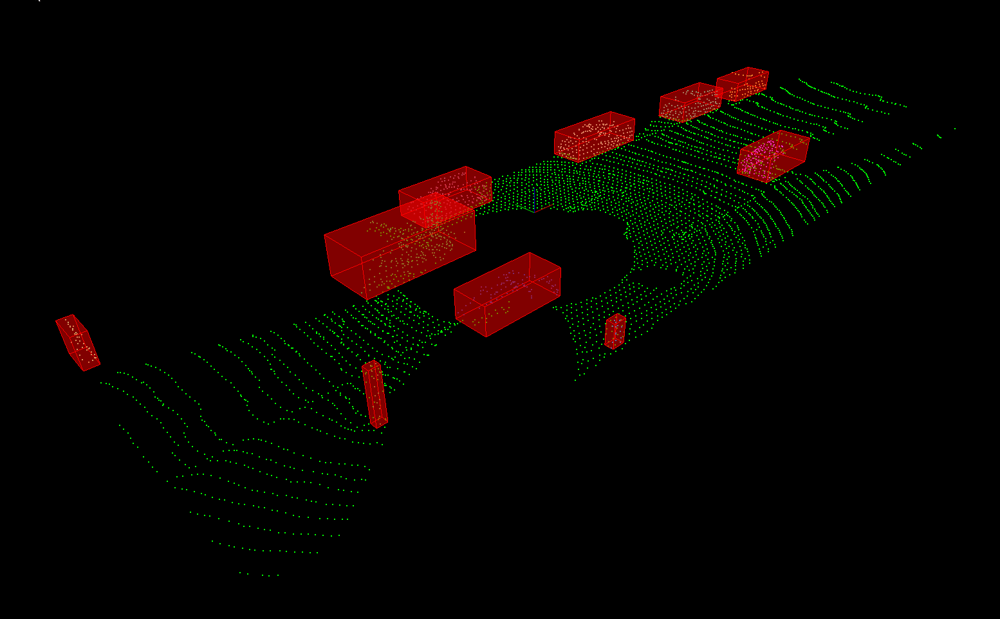

# Lidar Obstacle Detection

This is the first project of Udacity's Sensor Fusion Nanodegree program.

In this project I have implemented plane segmentation algoritm, KD-Tree and Eucledian clustering algorithm all from scratch as taught in the course lesson. The code might not be as elegant as a professional software engineer but the code is efficient and it runs as expected.

## Building the code.
```
git clone
cd lidar_obstacle_detection
mkdir build && cd build
cmake ../
make
```

Once the make process is successful, an executable file under tha name **lidar\_obstacle\_detection** will be created.

You can run the code using the following command

```
./lidar_obstacle_detection
```

## Usage
The code takes one or no command line arguments. The ***pcd*** data streams used in the project is present in the [src/sensors/data/pcd](src/sensors/data/pcd) dirctory. If you have your own data set that you world like to try, then put them in this directory path under a different directory name and you can provide dirctory name as a command line argument as shown in usage 2 below. 

#### Usage 1: No command line argument

If you don't provide any command line argument, the code will take data_1 directory by default to run the code.

**Command**: `./lidar_obstacle_detection`

**Output**: The result of running data_1 through lidar obstacle detection pipeline will be like the one shown below.



#### Usage 2: Directory name as command line argument

If you have a directory full of chronologically named ***pcd*** files, then you can put the files under  the [src/sensors/data/pcd](src/sensors/data/pcd) directory and provide the directory name as command line argumet.

**Command**: `./lidar_obstacle_detection`

For example, if to run the [data_2](src/sensors/data/pcd/data_2) directory through the lidar obstacle detection pipeline you should use the following command `./lidar_obstacle_detection data_2`

**Output**: The result of running data_2 through lidar obstacle detection pipeline will be like the one shown below.


**Author: Brolin A**

**Email: abrolin56@gmail.com**